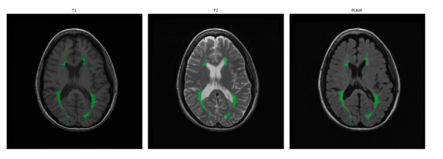
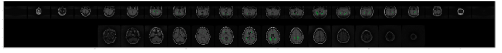
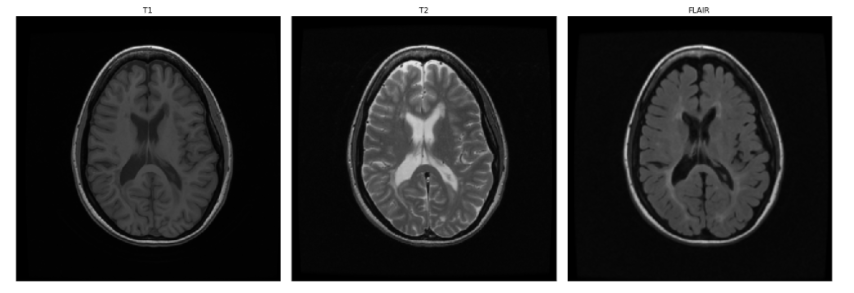
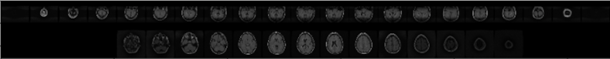

Deep learning for MS lesion segmentation
========================================================
author: Karma Tarap & Alexander Noll
date: 14-12-17
autosize: true

Multiple Sclerosis Background
========================================================

Multiple sclerosis (or MS) is a chronic disease that attacks the
central nervous system (brain and spinal
cord). 

Symptoms can be mild to severe leading to paralysis and/or loss of vision.

Caused by demyelination of nerve fibers that leads to scarring (sclerosis).

Scarring observed as **lesions** on **MRI scans**

Multiple sclerosis & MRI
========================================================

Multiple sclerosis & MRI
========================================================

Difficulty of MRI segmentation
========================================================

+ MRIs are expensive
+ MRIs are big ($512 \times 512 \times 512$ voxels (3d pixel))
+ Expert annotations are expensive
+ Expert annotations are highly variable
+ Class imbalance (1.5% of brain mass for patients experiencing a lesion)

$\Longrightarrow$ Expert annotation for supervised learning is not feasible, thus we are left with very few annotated MRI scans

Data Source
========================================================

MICCAI 2008

Medical Image Computing and Computer assisted intervention

+ 20 segmented MRI images from 2 sources
+ Standard benchmark for MS segmentation

Deep learning for lesion segmentation
========================================================

Similar to image segmentation: work with **3D convolutional neural networks** and classify each voxel individually: direct segmentation very hard because of small training set (20 MRIs)

Enhance data with **Generative adverserial networks** and use **semi-supervised learning**

Semi-supervised learning
========================================================

Use **combination** of **labelled** and **unlabelled** data

Build classifier to distinguish labelled from unlabelled data and distinguish labels between each other:

+ Binary classifier lesion vs non-lesion becomes
+ Trinary classifier lesion vs non-lesion vs unlabelled

Results
========================================================

- Trained GAN to generate additional patches of lesions
- Set up pipeline for model tuning
- Experiencing difficulties training the classification model
  - Weak signal or bug in pipeline?

Future Work
========================================================
  - Incorporate GAN directly into classifier
  - Add more data sources
  - Submit predictions to MICCAI and other competions
  - Test on *real* clinical data from ongoing trials

*Looking for team members*
